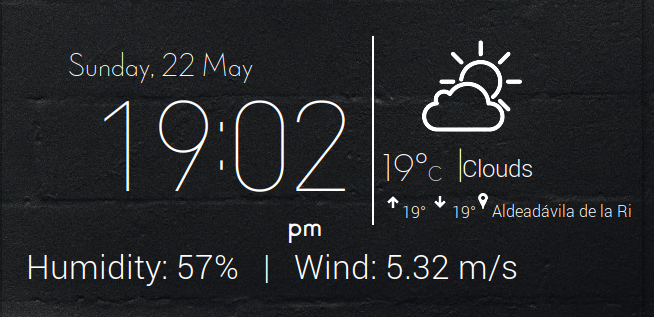

# Eleg-weather - custom layout

I cloned the [eleg-weather conky configuration](https://github.com/sstojkovic/eleg-weather-conky)  from Github and I chankged the script to make another one called something.lua

     (LC_TIME=en_GB.UTF-8 conky -c ~/Personal/eleg-weather-conky/something.lua &)
     
 And the result is  quite nice:
 
 
 
 